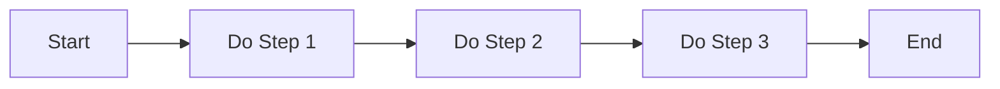
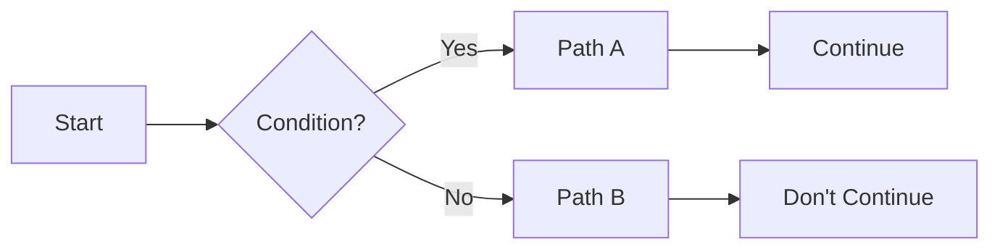
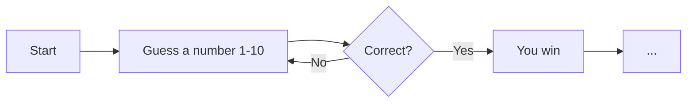
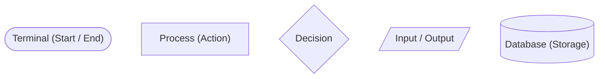

# Flowcharts
visual algorithms

---

## Action

Represented in *squares*



Flowcharts take advantage of the fact that humans are *much better* at processing *visual* information, than textual

---
layout: center
---

# Remember the Robot Maze
Given the `robot` and maze from the previous lesson, make a flowchart to get it from point A to point B

---

## Decisions

Represented using *diamonds*



Almost *every single program* is simply a combination of *steps* and *decisions*

If you can find a problem, and break it down into a series of *steps and decisions*, then you can make a program for it

---
layout: center
---

# Recommendation flowcharts

---

## Loops

Represented using a *combination* of decisions and steps, characterized by
- a visible *loop*
- a decision point for starting or stopping the loop



---
layout: center
---

# Back to the maze (again)

Assume the `robot` has an extra function called 

- `check if front is obstructed` and the robot will say *yes* if it is, and *no* if it isn't 

Create a flowchart that solves the maze with **only one** `move forward` action block being used

So the possible actions are
- check if front is obstructed
- check if left is obstructed
- check if right is obstructed
- check if back is obstructed
- turn right 90 degrees
- turn left 90 degrees
- move forward (limited to 1)

---

## Other shapes

| Shape | Name | Symbol |
|---|---|---|
| Oval | Start / End | `( )` |
| Rectangle | Action / Process | `[ ]` |
| Diamond | Decision | `{ }` |
| Parallelogram | Input / Output | `/ /` |
| Cylinder | Data / Storage | `[( )]` |



---
layout: center
---

# Morning routine flowchart
build a flowchart for your morning routine

You can use draw.io, excalidraw, paint, paper, etc 

---
layout: center
---

# Sorting algorithm flowchart
build a flowchart that sorts 5 jumbled numbers

You're possible moves are
- select the first number
- move the selection left
- check current number
- check the number after the current
- compare values
- swap
- check if sorted

From 
```
51428 -> 14258
```
