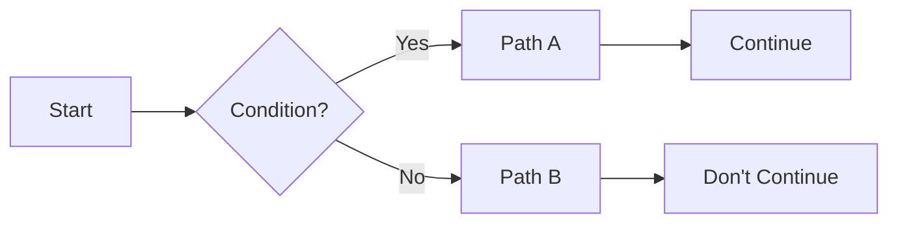
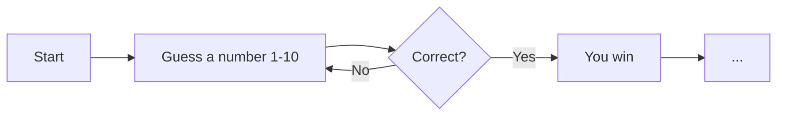

# Flowcharts
visual algorithms

---

## Action

Represented in *squares*

---
layout: center
---

# Remember the Robot Maze

---

## Decisions

Represented using *diamonds*

Almost *every single program* is simply a combination of *steps* and *decisions*

If you can find a problem, and break it down into a series of steps and decisions, then you can make a program for it

---

## Loops

Represented using a *combination* of decisions and steps, characterized by
- a visible *loop*
- a decision point for starting or stopping the loop

---
layout: center
---

# Book recommendation flowchart

---
layout: center
---

# Morning routine flowchart
build a flowchart for your morning routine

---
layout: center
---

# Sorting algorithm flowchart
build a flowchart that sorts 10 jumbled numbers (0, 1, 2, ..., 9)

