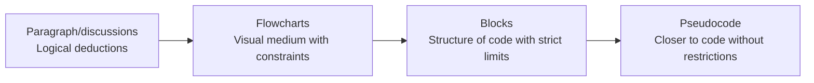

# Blocks

---

## Progression of complexity

Programming *can* be quite complex, in order to traverse that complexity and only care about the concepts one at a time

---

## Blocks and Scratch

When talking about blocks, the primary tool being used is

[scratch](https://scratch.mit.edu/)

A little bit of history:
- scratch is a block based programming language and website created in *2003*
- It was made by the `MIT Media Lab` for the purposes of education

Today it's a popular game engine, especially for beginner programmers

[demo](https://scratch.mit.edu/users/ZonxScratch/)

[other demo](https://scratch.mit.edu/studios/33764016/)

---

## Scratch Interface

---
layout: center
---

## Fundamental Concepts in Scratch

---

## Code Blocks

There are 9 different block categories with different *colors*

of note is the **hat block*

`when [flag] clicked` which is used at the top of a programming *stack*

To create a program, drag blocks from the palette to the *blank space*, and *interlock* blocks together

---

## First program

https://scratch-tutorial.readthedocs.io/fr/latest/1_intro/intro.html#your-first-program

---

## Sprites

Sprites are *objects* in the game, these objects have *properties*

In particular, a *direction*, an *x* and a *y* position

---

