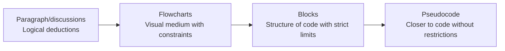

# Blocks

---

## Progression of complexity

Programming *can* be quite complex, in order to traverse that complexity and only care about the concepts one at a time

---

## Blocks and Scratch

When talking about blocks, the primary tool being used is

[scratch](https://scratch.mit.edu/)

A little bit of history:
- scratch is a block based programming language and website created in *2003*
- It was made by the `MIT Media Lab` for the purposes of education

Today it's a popular game engine, especially for beginner programmers

[demo](https://scratch.mit.edu/users/ZonxScratch/)

[other demo](https://scratch.mit.edu/studios/33764016/)

---

## Scratch Interface

---
layout: center
---

## Fundamental Concepts in Scratch

---

## Code Blocks

There are 9 different block **categories** with different *colors*

of note is the *start block*

`when [flag] clicked` which is used at the top of a programming **stack**

To create a program, drag blocks from the *palette* to the *blank space*, and *interlock* blocks together

---
layout: center
---

# First program

https://scratch-tutorial.readthedocs.io/fr/latest/1_intro/intro.html#your-first-program

---

## Sprites

Sprites are *objects* in the game, these objects have *properties*

In particular, a *direction*, an *x* and a *y* position

---

## Moving the sprite

1. Select the *events* category
2. Drag the "when [flag] clicked"
3. select the *motion* category
4. Drag the *move 10 steps* block to the cavnas and attach it

---

## Interacting with the sprite

1. In the control category, drag the *when space key pressed* block to the board
2. In the motion category, add a motion below the press 

Challenge number 1

> Make a game where if I press left and right, I move left or right

---

## Other ways of moving

1. Add another if key pressed block
2. In the motion category, select the *change x by* block

1. Add another if key pressed block
2. In the motion category, select the *set x to* block

---

## Costumes in scratch

Every *sprite* can have multiple *costumes*

Otherwise known as *frames*

given that in the **looks** category, there's a *next costume* block, make your sprite "*walk*", whenever it moves

---

## Challenge number 1

Given these blocks, make the cat

1. move when you start the game (with the flag)
2. bounce on the edge of the screen
3. have a walk animation
4. have a `0.2` second delay

> Note, set the inital direction of the sprite to not be 90 degrees
