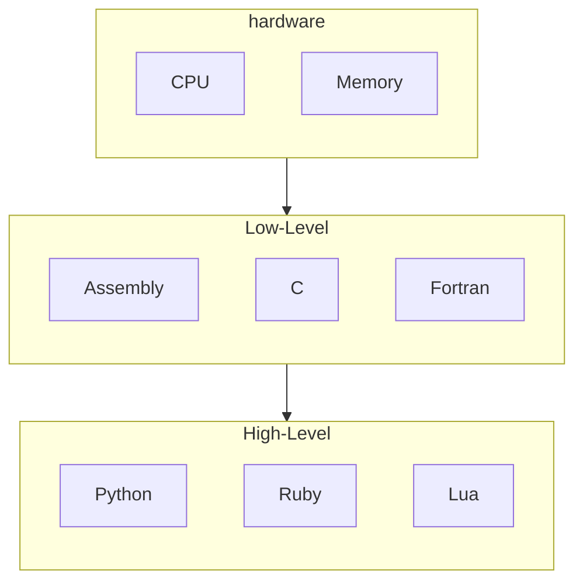
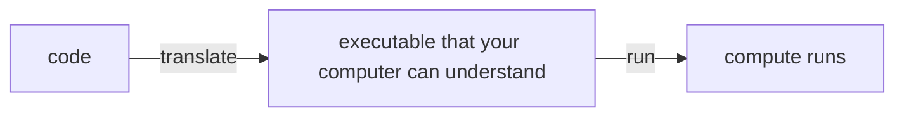
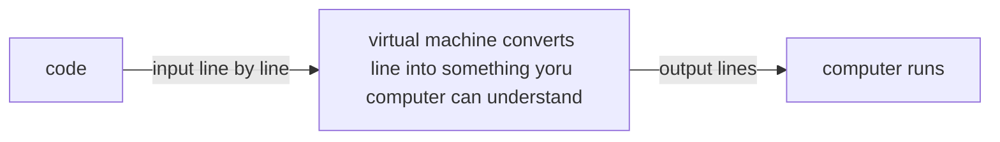
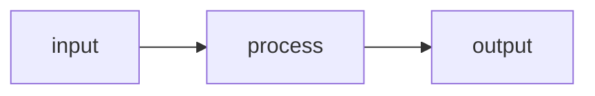

# A *fairly* gentle introduction to python

---
layout: center
---

# What is python

---
layout: center
---

## Python

A *high level*, `interpreted`, object oriented, **general purpose** programming language that emphasizes readability and developer ease of use

It also has a *REPL*, and runs through a *virtual machine*

---
layout: center
---

# Levels in programming languages

---
layout: two-cols-header
---

## high vs low level

::left::
A "*level*" in programming language **isn't** a formal definition, it depends on your field and the context

In programming:
- It generally means that a language is **farther away** from what a computer can do

`C` could be high level, `fortran` could be high level, `assembly` could be high level depending on your perspective

But in *common practice*, 

The languages above would be **low level**, and

**high level** would usually mean languages like `Python`, `Ruby`, and `Lua`

::right::



---

## Why is python a high level language

`Python` can do *very* complex things very easily, 

Not because it's **not** limited by the same limitations, 

But because every single python action is just a really really long series of simple actions

```python
names = ["alice", "bob", "charlie"]
for name in names:
    print(name.title())
```

Under the hood that single `print(name.title())` triggers dozens of function calls, memory allocations, and system calls 

Python just hides them so you don't have to think about it.

---
layout: center
---

# It's interpreted

---

## Interpreted Languages

Generally, it means that the language is **slower** but offers *nice to haves* like 
- No compiling, and 
- Dynamic typing

---
layout: center
---

# It's object oriented

---
layout: two-cols-header
---

## Object oriented programming languages

::left::
Not important right now, but it means there's this thing called "*objects*" that we'll have to care about

Some of you will have an entire semester for this

Generally it means that most things in `Python` have:
- attributes (things that it *is*)
- methods (things that it can *do*)

::right::
For example:
> A number, like `5`

- **represents** the value of 5 things, 
- it can be **used** for some operations, and
- **can be** rounded, converted into hexadecimal, etc


---
layout: center
---

# General purpose programming language

---

## Types of programming languages

There are generally two kinds of programming languages

**General purpose** - built to solve *any* kind of problem
- Python, Java, C++, JavaScript
- You can build websites, games, data tools, robots, whatever

**Domain specific** — built for *one* kind of problem
- SQL - querying databases
- HTML/CSS - web page structure & style
- MATLAB - numerical computing

---
layout: center
---

# it has a repl

---

## REPL

A **REPL** (**R**ead **E**valuate **P**rint **L**oop) lets you type Python code and see results immediately without needing a file

```python
>>> 2 + 2
4
>>> "hello".upper()
'HELLO'
```

This makes it great for *experimenting*, *testing ideas*, and *debugging*

---
layout: center
---

# Virtual Machine

---

## How programs runs (and how code runs on your computer)

`Python` runs through a **virtual machine**

A lot of programming languages are "*compiled*" which means you get code, transform it into something the computer can understand, then you run that



Python is not one of those languages, instead it runs on a *virtual machine*, that reads your code, and spits out code that the computer can run



---
layout: center
---

# filenames and commands

---

## Why we have filename extensions, and how programs run

*Extensions* (`.py`, `.txt`, `.jpg`) tell the operating system what program should open the file:

The extension itself doesn't change what's *inside* the file. 

You *can* name a Python script `myprogram.txt` and still run it with `python myprogram.txt`

```bash
python my_script.txt
```

Under the hood, every computer simply **runs** the language *program*, and that program takes in input of text

---

# Code jumpscare

```python
x = 0
y = 0

if left_arrow == "pressed":
    x = x + 1
    y = -20

if x > 20:
    x = -20

if x < -20:
    x = 20
```

---

## Variables

A **variable** is a named *box* that holds a value. 

Think of it like a Scratch variable, same idea, different syntax.

```python
name = value

x = 20
message = x
message = "hello"
```

In Scratch you drag blocks. Here you **type**

But the concept is identical: **a label that points to a piece of data**.

Variables let you *store*, *reuse*, and *change* data throughout your program. 

Instead of hardcoding `20` everywhere, you write `x = 20` once and use `x`. Change `x` in one place, it updates everywhere.

---
layout: center
---

# Expressions and Evaluations
The core of and basically any programming language

---

## Expression

An **expression** is any piece of code that **produces** a value.

```python
2 + 2            # 4
"hello"          # "hello"
5 > 3            # True
x * 10           # depends on what x is
```

If it **evaluates to something**, it's an expression. 

- A single number like `42` is an expression. 
- `42 + 8` is also an expression

---

## Evaluation (and how data gets processed)

When Python sees an expression, it **evaluates** it — reduces it down to a single value.

```python
>>> 2 + 3
5

>>> 5 > 3
True

>>> (2 + 3) * 4
20
```

Python works **inside out**, it evaluates the innermost parts first, then works its way up. 

This is called the **order of operations** (PEMDAS still applies).

---

## Operations

Operations in Python fall into two categories.

1. Arithmetic - produces a `number`

```python
+   -   *   /        # add, subtract, multiply, divide
%                    # modulo (remainder) — 10 % 3 → 1
//                   # floor division — 10 // 3 → 3
```

`%` is useful for checking even/odd (`x % 2 == 0` means even) or wrapping around a range.

2. Comparison - produces `True`/`False`

```python
==   !=     # equal, not equal
>    <      # greater than, less than
>=   <=     # greater/less than or equal
```

---

## Exercise

```python
10 + 5 * 2
17 % 5
17 // 5
(2 + 3) >= 5
(10 % 3) * (8 // 3) + 1
"py" + "thon" + " " + "3"
5 > 3 and 10 < 20
```

You are allowed to use online python interpreters to solve these

https://www.pythonmorsels.com/repl/

---
layout: two-cols-header
---

## The first output function, and how functions work

::left::
```python
print("hello")
print(42)
print(2 + 3)
```

Think of `print()` as a **box**

The box has:
- a *name* on the front (print)
- 2 holes on either side
- a person inside
- *instructions* that the person will follow

All you're doing is putting something into the left hole, and waiting for something to come out the right hole

::right::



> Note that `print()` doesn't actually have output

Prints instructions are to get whatever the input is, and then write it out, but it **doesn't** return a value

If you were to evaluate this line

```python
5 + print("hello")
```

The program would *say* `hello`, then it would try to add `5` and a `None` since print doesn't evaluate to anything

---

## Data Types

In real life, a **letter** and a **number** behave differently, you can add numbers but you can't add letters. 

> Python is the same.

Every value in Python has a *type* that determines *what you can do with it*.

You can use the `type()` function to figure out what the type of a specific value is

```python
type(42)       # <class 'int'>
type(3.14)     # <class 'float'>
type("hi")     # <class 'str'>
type(True)     # <class 'bool'>
```

---

## Data types (cont)

| Type | Name | Example | What you can do |
|---|---|---|---|
| `int` | Integer | `42` | `+ - * / % //` |
| `float` | Decimal | `3.14` | `+ - * /` (math with decimals) |
| `str` | String (text) | `"hello"` | `+` (concatenate), `*` (repeat) |
| `bool` | Boolean | `True` / `False` | `and`, `or`, `not` |

---

## Data types (cont)

Mixing types can cause errors:

```python
>>> "hello" + 5
TypeError: can only concatenate str (not "int") to str
```

Python *can* guess, but sometimes, it needs you to be explicit. 

Convert with `str()`, `int()`, `float()`:

```python
>>> "hello" + str(5)
'hello5'
```

Think of operations as **boxes with shaped holes** 

The arithmetic `plus` operation would be a box with two square holes

A round peg (`str`) won't fit in a square hole (`int` math). 

---

## If statements

An `if` statement lets your code *make decisions*

```python
if condition:
    # do this only if condition is True
else:
    # do this only if condition is False
```

For example
```python
age = 18

# note that if statements only accept true or false
# the condition below simply evalutates into one
if age >= 18:
    print("You can vote")
else:
    print("Too young")
```

---

## Revisiting that earlier code 


```python
x = 0
y = 0

if left_arrow == "pressed":
    x = x + 1
    y = -20

if x > 20:
    x = -20

if x < -20:
    x = 20
```
