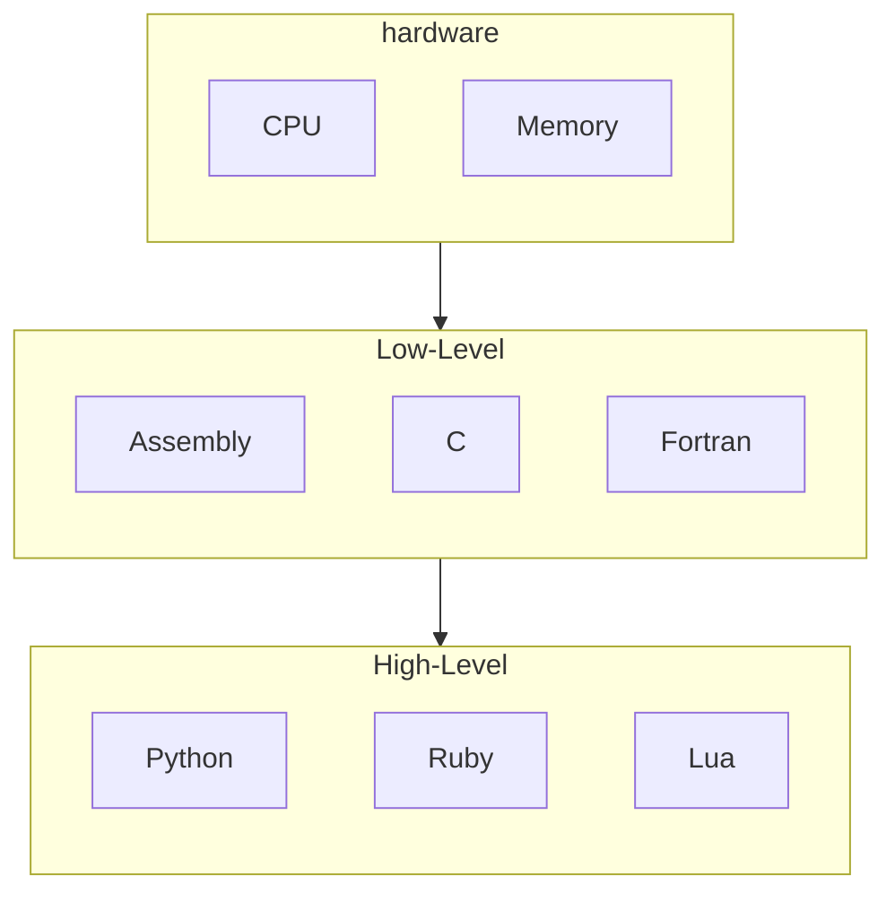
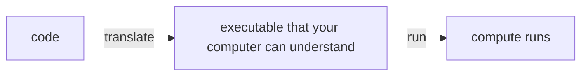
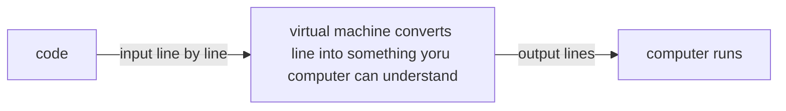

# A *fairly* gentle introduction to python

---
layout: center
---

# What is python

---
layout: center
---

## Python

A *high level*, `interpreted`, object oriented, **general purpose** programming language that emphasizes readability and developer ease of use

It also has a *REPL*, and runs through a *virtual machine*

---
layout: center
---

# Levels in programming languages

---
layout: two-cols-header
---

## high vs low level

::left::
A "*level*" in programming language **isn't** a formal definition, it depends on your field and the context

In programming:
- It generally means that a language is **farther away** from what a computer can do

`C` could be high level, `fortran` could be high level, `assembly` could be high level depending on your perspective

But in *common practice*, 

The languages above would be **low level**, and

**high level** would usually mean languages like `Python`, `Ruby`, and `Lua`

::right::



---

## Why is python a high level language

`Python` can do *very* complex things very easily, 

Not because it's **not** limited by the same limitations, 

But because every single python action is just a really really long series of simple actions

```python
names = ["alice", "bob", "charlie"]
for name in names:
    print(name.title())
```

Under the hood that single `print(name.title())` triggers dozens of function calls, memory allocations, and system calls 

Python just hides them so you don't have to think about it.

---
layout: center
---

# It's interpreted

---

## Interpreted Languages

Generally, it means that the language is **slower** but offers *nice to haves* like 
- No compiling, and 
- Dynamic typing

---
layout: center
---

# It's object oriented

---
layout: two-cols-header
---

## Object oriented programming languages

::left::
Not important right now, but it means there's this thing called "*objects*" that we'll have to care about

Some of you will have an entire semester for this

Generally it means that most things in `Python` have:
- attributes (things that it *is*)
- methods (things that it can *do*)

::right::
For example:
> A number, like `5`

- **represents** the value of 5 things, 
- it can be **used** for some operations, and
- **can be** rounded, converted into hexadecimal, etc


---
layout: center
---

# General purpose programming language

---

## Types of programming languages

There are generally two kinds of programming languages

**General purpose** - built to solve *any* kind of problem
- Python, Java, C++, JavaScript
- You can build websites, games, data tools, robots, whatever

**Domain specific** — built for *one* kind of problem
- SQL - querying databases
- HTML/CSS - web page structure & style
- MATLAB - numerical computing

---
layout: center
---

# it has a repl

---

## REPL

A **REPL** (**R**ead **E**valuate **P**rint **L**oop) lets you type Python code and see results immediately without needing a file

```python
>>> 2 + 2
4
>>> "hello".upper()
'HELLO'
```

This makes it great for *experimenting*, *testing ideas*, and *debugging*

---
layout: center
---

# Virtual Machine

---

## How programs runs (and how code runs on your computer)

`Python` runs through a **virtual machine**

A lot of programming languages are "*compiled*" which means you get code, transform it into something the computer can understand, then you run that



Python is not one of those languages, instead it runs on a *virtual machine*, that reads your code, and spits out code that the computer can run



---
layout: center
---

# filenames and commands

---

## Why we have filename extensions, and how programs run

*Extensions* (`.py`, `.txt`, `.jpg`) tell the operating system what program should open the file:

The extension itself doesn't change what's *inside* the file. 

You *can* name a Python script `myprogram.txt` and still run it with `python myprogram.txt`

```bash
python my_script.txt
```

Under the hood, every computer simply **runs** the language *program*, and that program takes in input of text

---

# Code jumpscare

```python
x = 0
y = 0

if left_arrow == "pressed":
    x = x + 1
    y = -20

if x > 20:
    x = -20

if x < -20:
    x = 20
```

---

# operations

```
+ - * /
```

```
!= == >= > < <=
```

```
% //
```

---

## Evaluation (and how data gets processed)


---

# output (and also functions)

```
print()
```

think of this as a box (function) with two holes, one on the left and one on the right

you put someting in the left whole

then you get osmething out of the right whole

---

# data types

What is the difference between e letter and a number (in real life)


if you think of operatiosn as boxes sometimes boxes have different shaped holes

---

# variables

scratch equivalence

main difference

box

```
name = value
x = 20
```

different types

main strength

you can use them for everything

---

# if statements

it's another box

```
if 5 == 20:
    print("correct")
else:
    print("incorrect")
```


---

# Code jumpscare


```python
x = 0
y = 0

if left_arrow == "pressed":
    x = x + 1
    y = -20

if x > 20:
    x = -20

if x < -20:
    x = 20
```
