# Computer Organization And Architecture

How and why a computer works

---
layout: two-cols-header
---

## What is a digital computer

::left::
A *machine* that can do *work* for people by **carrying out instructions**

1. A sequence of instructions is a *program*
2. Electronic circuits can execute a *limited set of instructions*

These include things like 
- adding two numbers
- checking if a number is zero
- copying data from one part of memory to another

These *primitive* instructions, together, form a *language* called **machine language**

::right::

So when designing a new computer, one must decide on what instructions to include

Where *less and simpler* instructions mean a *cheaper and faster* computer

---
layout: center
---

# It's difficult to use machine language
so complexity starts to appear

Whenever a it becomes tedious and difficult to use, an **abstraction** is made

Each *layer* of this abstraction has it's own *complexity*

And this course will be going through most of these layers to more easily understand it

---
layout: center
---

# Languages
Fundamentally, what a person wants to *do* and what a computer *can* do have a very large gap

---

## Languages, levels, and Virtual Machines

Let's say that we have *two* languages
- `L1`, a language that's easier for a human
- `L0`, the language that the machine uses

A machine can **only** run programs in the `L0` language

To bridge that gap, there are *two* main methods

---
layout: two-cols-header
---

## Translation

::left::
1. Take the `L1` program,
2. take each instruction,
3. replace it with one or more `L0` instructions that are *equivalent*

In the end, you have a fully `L0` program that the machine can run

::right::
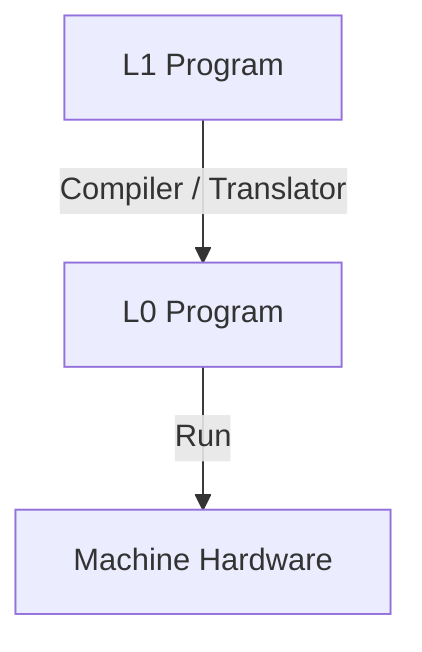
---
layout: two-cols-header
---

## Interpretation

::left::
1. Write an `L0` program that takes in `L1` as input
2. That `L0` program then translates each input as equivalent `L0` code
3. Then that `L0` code is run

::right::
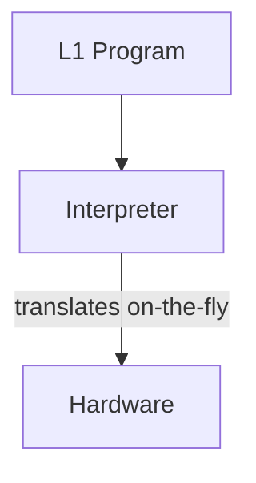
---
layout: two-cols-header
---

## Translation vs Interpretation

::left::
**Translation**
- `L0` program is in *control*
- Source -> standalone `L0` binary -> machine

**Interpretation**
- Interpreter is in *control*
- Source -> interpreter reads and translates live

::right::
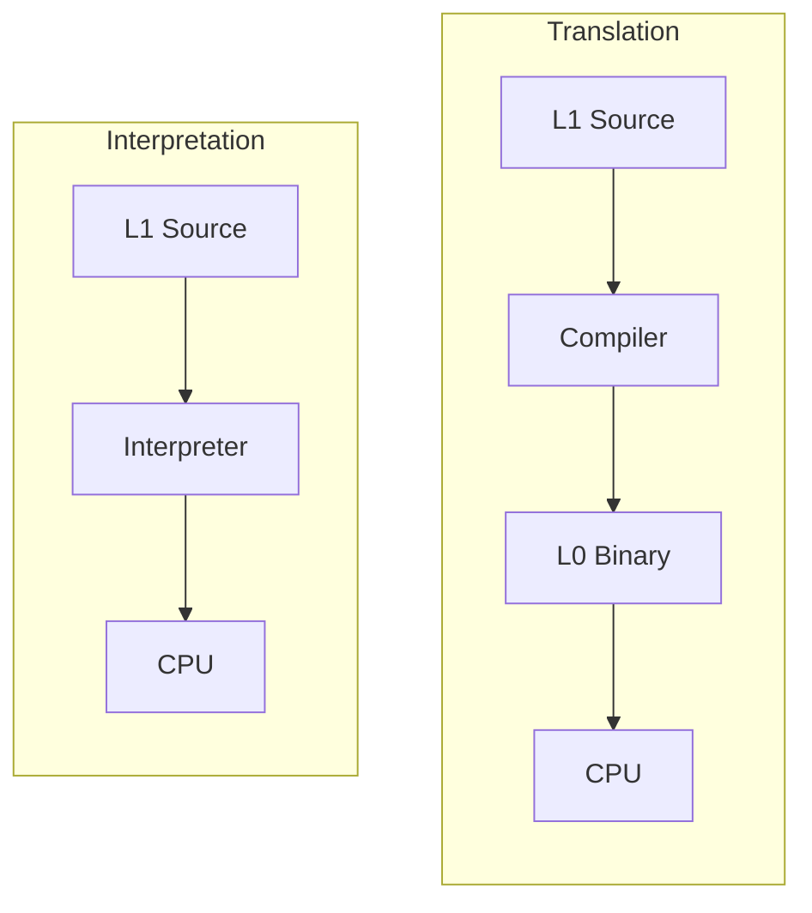

---
layout: two-cols-header
---

## Virtual Machines

::left::
One way of thinking about these different layers is through *virtual machines*

Where each *hypothetical* machine runs a specific language

Where `M0` would be a virtual machine that has a **physical** counterpart

In the case where `M1` could be constructed cheaply enough, `M0` would disappear

::right::
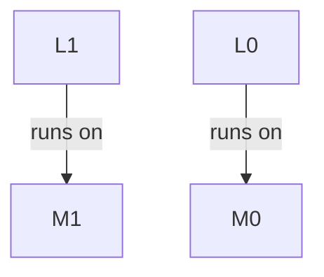

These languages (`L0` and `L1`) must not be *too* different

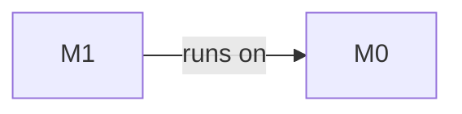

Usually this means that `L1` is only *slightly* more convenient than `L0`

---
layout: two-cols-header
---

## Multilevel machine

::left::
A computer with `n` levels can be regarded as `n` different virtual machines

Where programs in `Ln` are either *interpreted* by a program running on a *lower machine*

Or are *translated* to the machine language of a *lower machine*

Note that *level* and *virtual machine* are interchangeable but virtual machine does have a other meanings

::right::
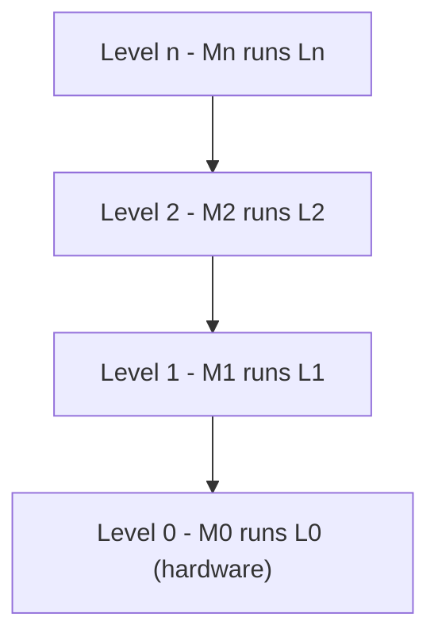

---
layout: center
---

# Contemporary multi level machines

---
layout: two-cols-header
---

## Contemporary multilevel machines

Most modern computers have two or more levels

We'll be going through each level

::left::
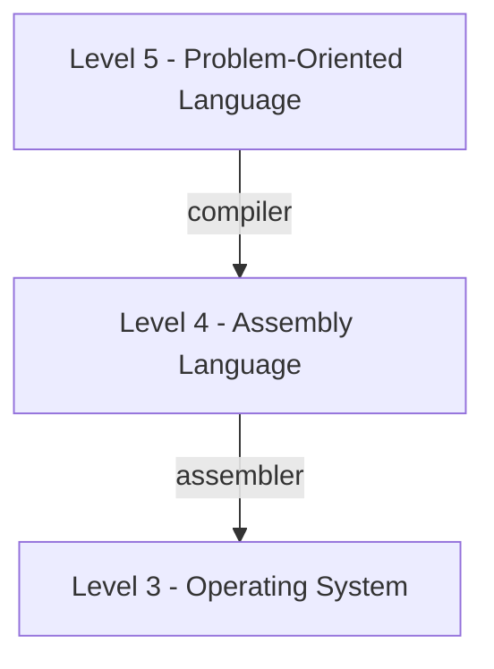

::right::
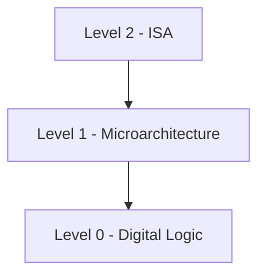

---
layout: two-cols-header
---

## Digital Logic Level

::left::
At the *lowest* level, we have 

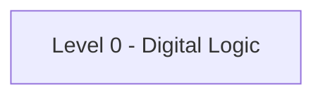

This has something called **gates** built from analog components like *transistors*

In this level, inputs of **1** and **0**s are present

And combinations of these gates allow for streams of *binary* to hold **memory**, do **mathematics**, and change **state**

::right::

---
layout: two-cols-header
---

## Microarchitecture Level

::left::
In this level, we have collections of *registers* and a circuit called the **Arithmetic Logic Unit** (ALU)

The ALU and registers form a *data path*
- *select* one or two registers
- ALU *operates* on them
- *store* result back

::right::
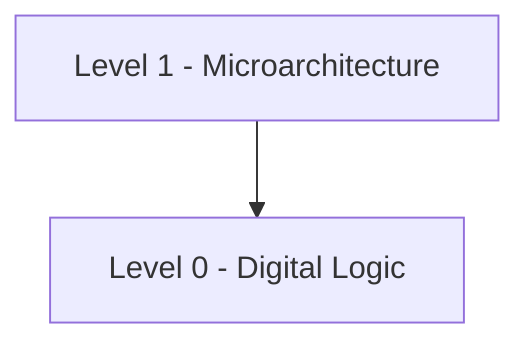
---
layout: two-cols-header
---

## Instruction Set Architecture Level

::left::
Every computer manufacturer publishes a manual for each of the computers it sells titled something like "*Machine Language Reference Manual*"

[risc-v manual](https://docs.riscv.org/reference/isa/v20260120/unpriv/rv32.html)

| Level | Example: `ADD R1, R2` |
|-------|----------------------|
| ISA | instruction fetched & decoded |
| Microarch | registers selected -> ALU adds |
| Digital Logic | transistors propagate -> result on bus |

::right::

---
layout: two-cols-header
---

## Operating System Level

::left::
Adds a set of instructions for 
- memory organization
- concurrency and parallelism
- and other features

Note that many operating systems **also** operate *within* the ISA level too

::right::
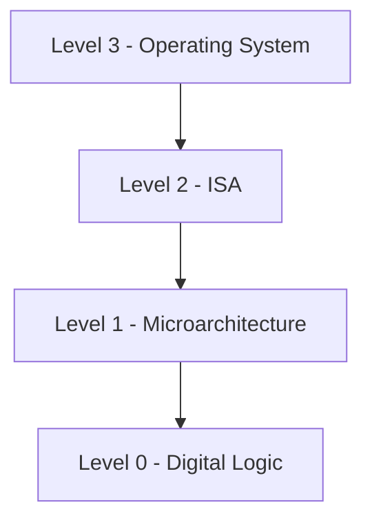
---
layout: two-cols-header
---

## Assembly Language Level

::left::
There is a break between levels 3 and 4

The lowest 3 levels are **not** designed to be used by a regular programmer

Level 4 and above is where *applications* start existing

Another difference is that levels 1-3 are *numeric* but assembly starts using *symbols*

At its core assembly is simple a **symbolic** representation of one of the lower levels

And it's then converted into a numeric with an **assembler**

::right::
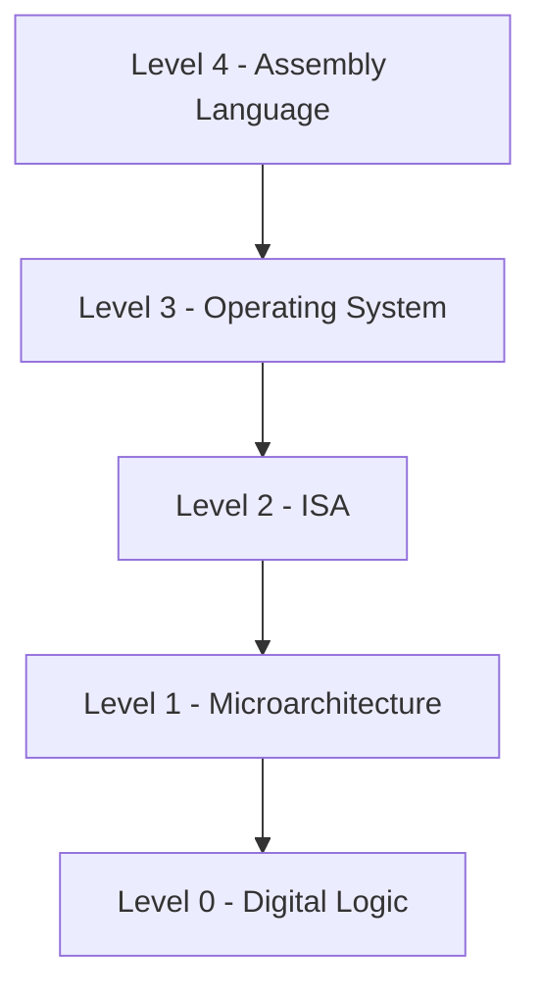
---
layout: two-cols-header
---

## Problem-Oriented Language Level

::left::
High-level languages (C, Java, Python, etc.)

A *compiler* or *interpreter* translates to lower levels

Provides abstractions like
- variables, functions, objects
- type systems and memory management
- far removed from hardware details

::right::
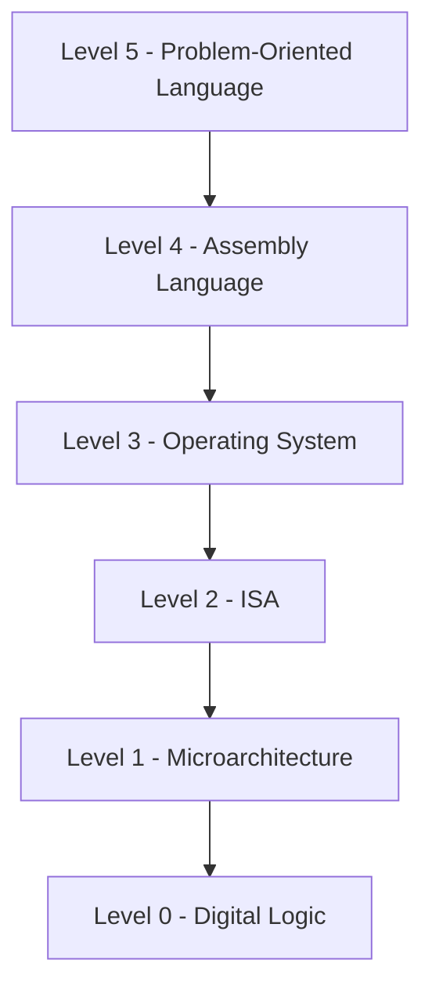

---

## Summary

- Computers are designed as a **series of levels**, each built on its predecessor
- Each level is a distinct **abstraction** suppressing irrelevant detail to reduce complexity

*Architecture* vs *Implementation*
- Architecture: visible to the user of that level (data types, operations, features)
- Implementation: how those features are realized (under the hood)

*Computer architecture* is the study of designing the visible parts of a computer system
