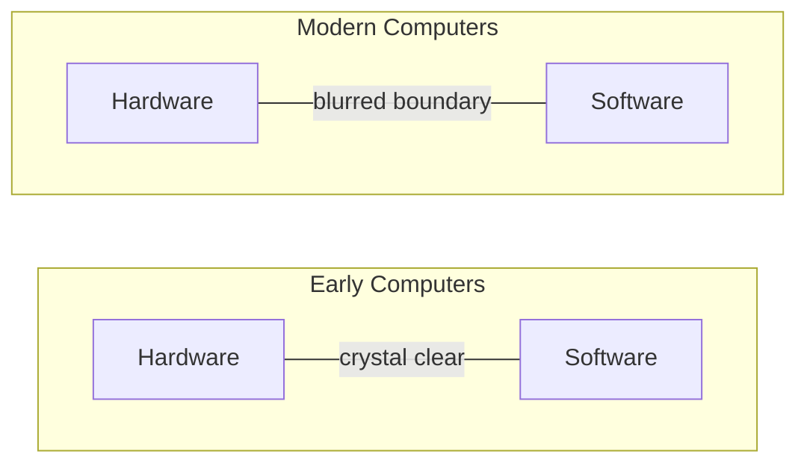
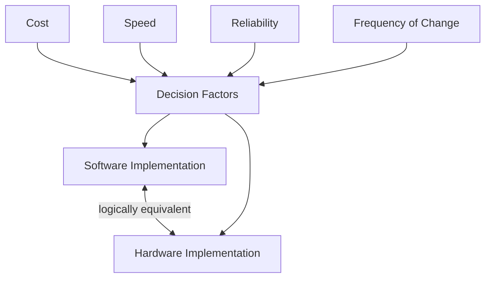
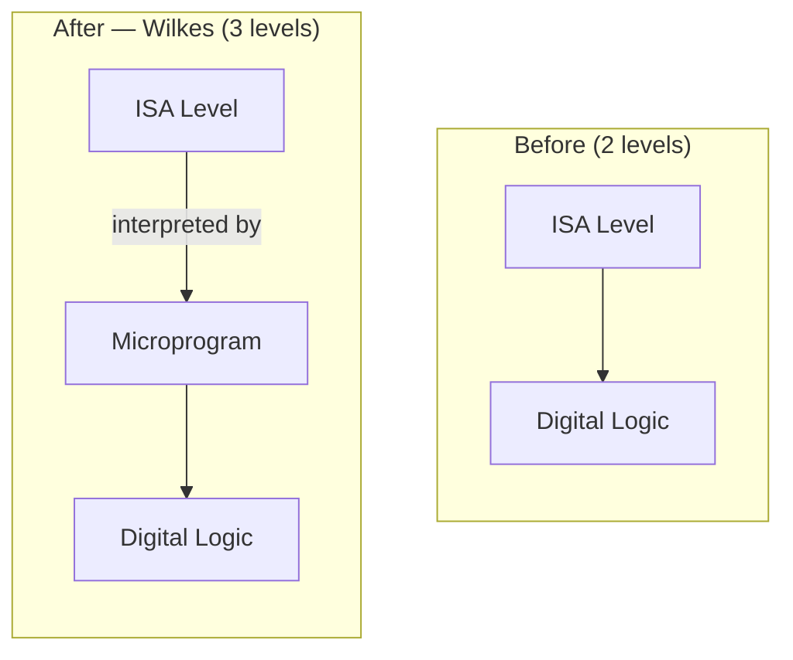
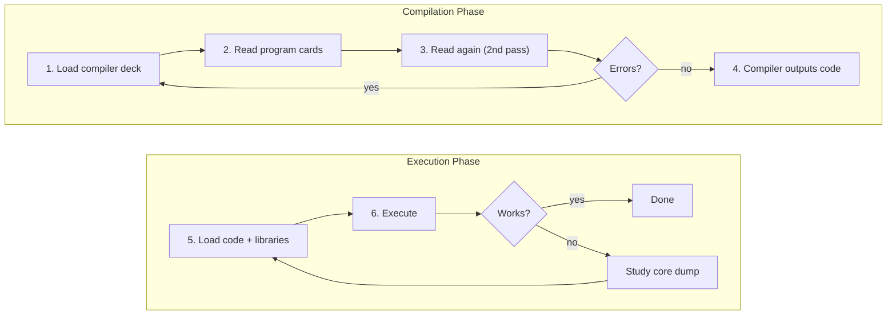
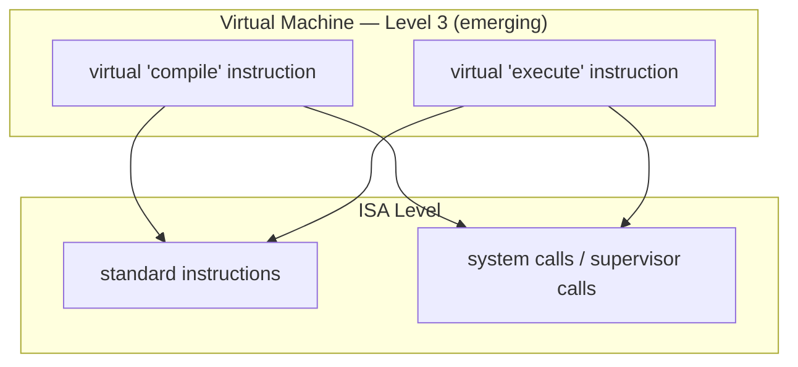
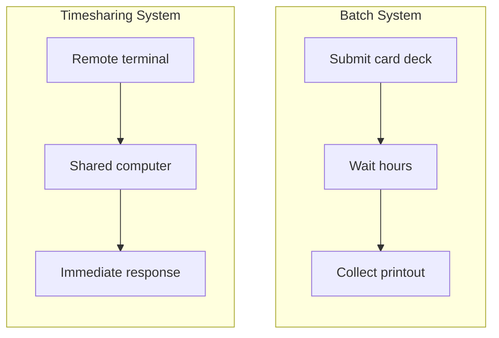
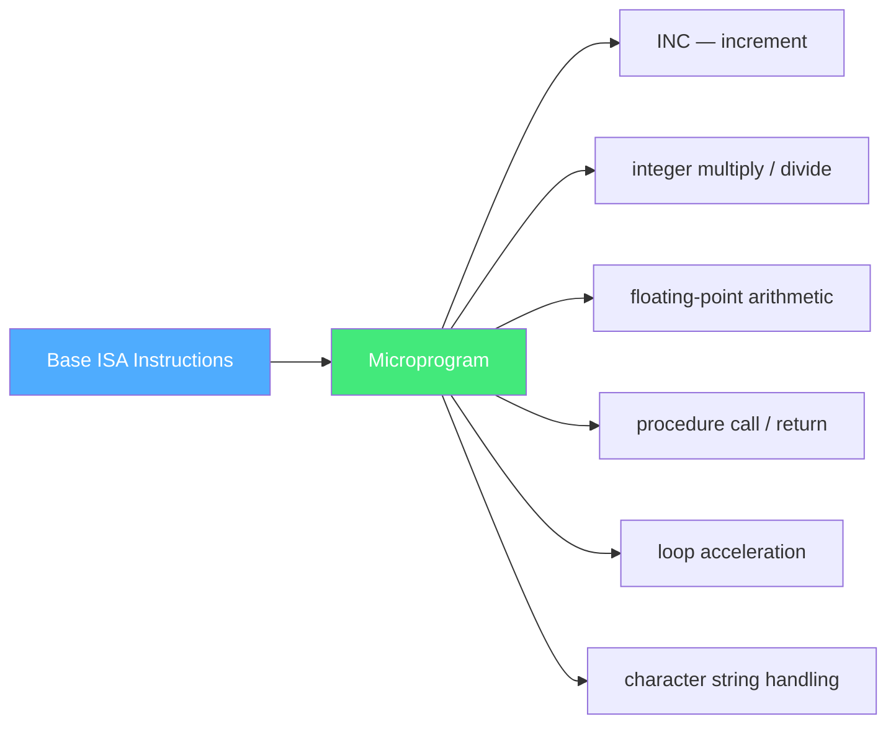
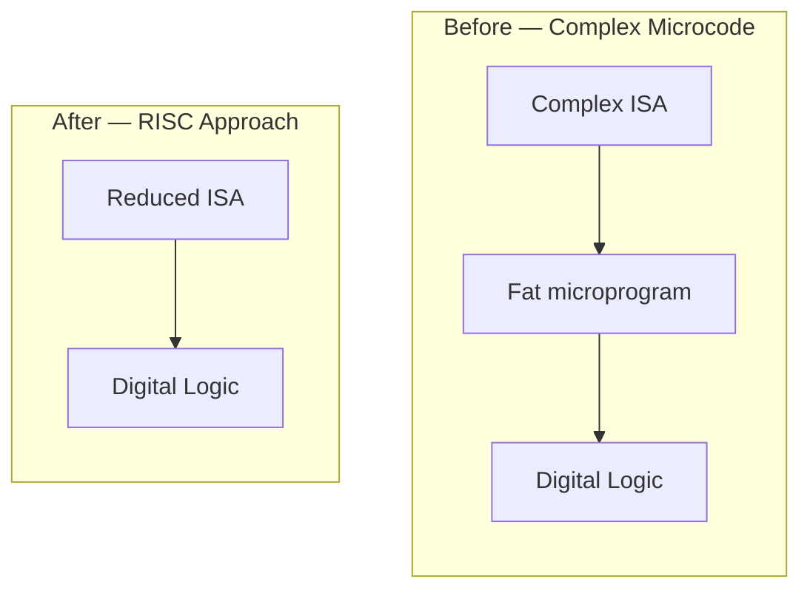

# Evolution of Multilevel Machines

To provide perspective on multilevel machines, we examine their historical development — how the number and nature of levels has evolved over the years

---

## Hardware vs Software

**Hardware** consists of tangible objects:
- integrated circuits, printed circuit boards
- cables, power supplies, memories, printers

**Software** consists of algorithms and their computer representations:
- detailed instructions telling how to do something
- the essence is the *instructions*, not the physical media

---

## Hardware vs Software

In the very first computers, the boundary was **crystal clear**

Over time it has **blurred** considerably due to the addition, removal, and *merging* of levels as computers *evolved*

---

## Hardware and Software are Logically Equivalent

*Any operation performed by software can also be built directly into the hardware*

And vice versa: any instruction executed by hardware can also be simulated in software

As Karen Panetta put it
> Hardware is just petrified software

The decision to put functions in hardware *or* software is based on:
- **cost** - which is cheaper to build or implement
- **speed** - hardware is faster, software is more flexible
- **reliability** - fewer components means fewer failure points
- **frequency of expected changes** - software is easier to modify

There are few hard-and-fast rules 

These decisions *shift* with technology economics, demand, and computer usage

---

## Hardware and Software are Logically Equivalent

---
layout: two-cols-header
---

## The Earliest Computers (1940s)

::left::
The first digital computers had only *two levels*:
- **ISA level (Level 1)** - where all programming was done
- **Digital Logic level (Level 0)** - which directly executed ISA programs

Programs written in true machine language could be *directly executed* by electronic circuits **without** any intervening interpreters or translators

The digital logic level's circuits were:
- complicated and difficult to understand and build
- physically demanding
- unreliable (vacuum tubes failed frequently)

::right::

---

## ISA programming

ISA programming is simply *no longer done today*, completely replaced by using assembly which is a symbolic representation of it

But the earliest programmable computer, like the *ENIAC* only had the *digital logic level* and the *instruction set architecture*

In order to program it, the steps would include
1. Writing, solving, and breaking down complex math into basic arithmetic steps
2. Creating a schematic map on how data should physically flow through the units
3. Plugging cables 
4. Setting switches

---
layout: two-cols-header
---

## Invention of Microprogramming (Wilkes, 1951)

::left::
In **1951**, Maurice Wilkes (University of Cambridge) suggested designing a *three-level computer* to 
- drastically simplify hardware and 
- reduce the number of unreliable vacuum tubes

The machine was to have a built-in, *unchangeable* interpreter (**microprogram**), whose function was to execute ISA-level programs by **interpretation**

Since the hardware would only execute *microprograms* instead of *ISA-level* programs 

1. Fewer electronic circuits were needed 
2. fewer tubes
3. **enhanced reliability**

::right::

---
layout: two-cols-header
---

## Microprogram Programming

::left::

::right::
The earliest forms of programming using the 3 layer machine used *paper strips* that had the program punched into them, and were *fed* into the machine

The machine would then read those punches, convert them into the correct series of `0`s and `1`s, which would then be run by the hardware

https://www.kloth.net/services/ttypunch.php

---
layout: center
---

## The Rise of Microprogramming

A few three-level machines were constructed during the **1950s**

More were constructed during the **1960s**

By **1970**, the idea of having the ISA level interpreted by a microprogram (instead of directly by the electronics) was **dominant**

All major machines of the day used it

---
layout: two-cols-header
---

## Early Computing - Operating systems

::left::
In the early years, most computers were **open shop**

- The programmer had to operate the machine *personally*

Next to each machine was a *sign-up sheet*. Programmers signed up for a block of time (e.g., Wednesday 3–5 AM)

They arrived with a deck of 80-column *punched cards*

Then they inputted the punched cards into the machine

::right::

This early system was frequently **idle** while
- people were carrying cards
- figuring out bugs
- and generally being inefficient

---

## Open Shop - Running a FORTRAN Program

---

## The First Operating System — FMS

Around **1960**, people tried to *reduce* wasted time by automating the operator's job

A program called an *operating system* was kept in the computer at all times

One of the first widespread OSes was **FMS (FORTRAN Monitor System)** on the IBM 709

| Card | Function |
|------|----------|
| `*JOB` | Accounting info |
| `*FORTRAN` | Load FORTRAN compiler from tape |
| `*DATA` | Execute translated program |
| `*END` | End of job |

The asterisk identified control cards so they would not be confused with program and data cards

---
layout: two-cols-header
---

## A New Virtual Machine is Born

::left::
The operating system was designed to automate the operator's job - but it was also the *first step* in the development of a **new virtual machine level**

The `*FORTRAN` card could be viewed as a virtual *"compile program"* instruction

The `*DATA` card could be regarded as a virtual *"execute program"* instruction

A level with only **two instructions** was not much of a level

::right::

These eventually evolved into 
- **operating system macros** / **supervisor calls** 

(modern term: **system call**)

Some instructions were identical to ISA, but others (especially I/O) were completely different

---
layout: two-cols-header
---

## Batch Systems -> Timesharing

::left::
**Batch systems** (early 1960s):
- Read card decks, printed output on line printer
- Wait of **several hours** between submission and results
- Developing software was *very* difficult

**Timesharing systems** (Dartmouth, MIT, early 1960s):
- Multiple programmers communicate *directly* with the computer
- *Remote terminals* connected via telephone lines
- Computer **shared** among many users
- Immediate results, type in a program, get output back almost immediately

::right::

---
layout: two-cols-header
---

## Migration of Functionality to Microcode

::left::
Once microprogramming was common (by **1970**), designers realized they could *add new instructions* by just **extending the microprogram**

They could add "hardware" (new machine instructions) by *programming*

This led to an **explosion in instruction sets** as designers competed to produce bigger and better instruction sets

Many instructions were *not essential* but they were slightly *faster*

Example: 
- `INC` (add 1) was not necessary (machines already had `ADD`), but it was a little faster

::right::

---

## Additional Microcode Features

Once designers saw how easy it was to add new instructions, they began looking for *other features* to add to their microprograms:

- **Indexing and indirect addressing**
- **Relocation facilities**
- **Interrupt systems**
- **Process switching**
- **Audio, image, and multimedia** processing instructions

Numerous other features and facilities were added, usually for speeding up some particular activity

---
layout: two-cols-header
---

## The Elimination of Microprogramming

::left::
Microprograms grew **fat** during the golden years (1960s–1970s)

They also tended to get *slower and slower* as they acquired more bulk

Researchers realized:
- *Eliminate* the microprogram
- *Vastly reduce* the instruction set
- Have remaining instructions be **directly executed** 

Result: machines could be **sped up**

Computer design had come *full circle*, back to the way it was before Wilkes invented microprogramming

::right::

<small>*this only works because memory now exists</small>

---

## The Wheel Keeps Turning

**Modern processors** still rely on *microprogramming* to translate complex instructions to internal **microcode** that can be executed directly on streamlined hardware

The boundary between hardware and software is *arbitrary and constantly changing*
- Today's software may be *tomorrow's hardware*, and vice versa
- Boundaries between levels are also *fluid*
- One person's hardware is *another person's software*

From the programmer's point of view, how an instruction is actually implemented is *unimportant* (except perhaps for its speed)
