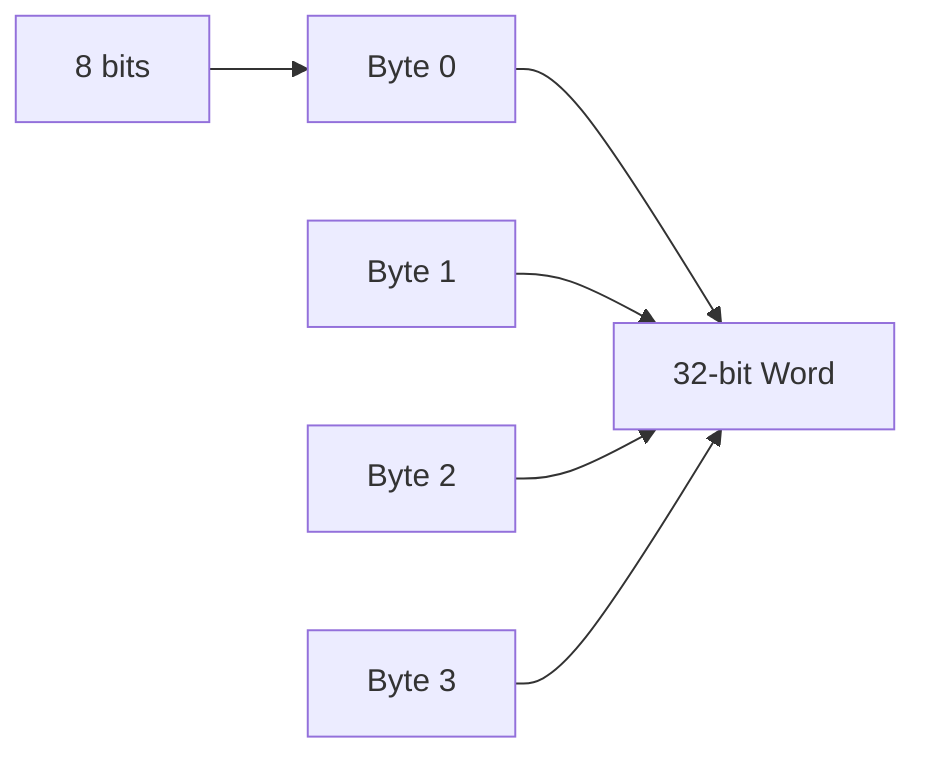

# Primary Memory

---

## Primary Memory

Where programs and data are stored

Can also be called *storage* but that term is usually reserved for **disk storage**

A non-negotiable part of computer operation

---
layout: center
---

# Bits

---

## Bits

The basic unit of memory for all computers is the **bit**

A bit contains either a `1` or a `0`

And computers use bits because they are more "*efficient*"

Specifically, bits offer two main benefits
- reliability
- information density

---
layout: two-cols-header
---

## Reliability

::left::


A transistor works by being an *on* and *off* switch

There are 3 pins
- *control*,
- *input*, and
- *output*

::right::

By applying a *small voltage* to the control pin, it will **open or close** the circuit, 

> This allows the input to go to the output

And if the output is over a certain *threshold*

**it's considered a 1**

If we made the threshold smaller, we could get more values `0 1 2 3 4`

However, the likelihood of *noise* affecting the reading increases

---
layout: two-cols-header
---

## Information Density

Some older large computers are advertised as having *decimal arithmetic*, they do this using **4 bits** to store a single decimal digit called a **BCD** (Binary Coded Decimal)

Let's assume $16$ bits

Both of the examples below show *1944*, but they have different **maximums**

::left::

**BCD**

```
0001 1001 0100 0100
```

Showcases 4 digits that can start at $0$ and end at $9,999$

```
1001 1001 1001 1001
```

For a total of $10,000$ unique combinations

::right::

**Binary**

```
0000 0111 1001 1000
```

Showcases 16 digits of binary that can have a maximum of $65,535$

And can store a total of $65,536$ unique combinations

---
layout: center
---

# Memory Addresses

---
layout: two-cols-header
---

## Memory Addresses

::left::
Memories consist of a number of **cells**

- each of which can store a *piece of information*,

- each has a number, called its **address** which programs can refer to,

- if a memory has $n$ cells, they will have *addresses* $0$ to $n-1$, and

- all cells in a memory contain the *same number of bits*

- if a cell consists of $k$ bits, then it can hold $2^k$ *combinations*

::right::

Below is an example of different combinations of a `96-bit` memory


---
layout: two-cols-header
---

## Memory Addresses (cont)

::left::
To **address** (meaning to find), a computer needs to have a certain amount of bits *reserved*

If an address has $m$ bits, the maximum number of cells *addressable* is $2^m$

*For example*

To be able to address *all* the memory locations on the example on the right

We need a **minimum length of $4$ bits**

Because an address length of $3$ bits can only address up to $2^3 = 8$ bits

Which cell does `0100` address?

::right::


---
layout: two-cols-header
---

## Cell

::left::
A **Cell** is the smallest *addressable unit* (row)

In recent years, the majority of computer manufacturers have standardized on an *8-bit cell*, which is called a **byte** (sometimes *octet*)

**bytes** are then grouped into **words**

- A `32-bit` computer has `4 bytes/word`
- A `64-bit` computer has `8 bytes/word`

::right::


---

## Bits vs Bytes

Storage and networking are sold in **bits** or **bytes**

| Scenario | Advertised as | What you get |
|---|---|---|
| Internet speed | `500 Mbps` (megabits/sec) | `62.5 MB/s` (megabytes/sec) - **8x slower** |
| SSD read speed | `3500 MB/s` | same - storage uses *bytes* |
| RAM bandwidth | `25.6 GB/s` | same - also bytes |
| Network interface | `10 Gbps` | `1.25 GB/s` real transfer |

A `500 Mbps` plan does **not** download a `5 GB` file in 80 seconds.  

It downloads `5 Gb` (gigabits) in 80 seconds — which is only `0.625 GB`.

---
layout: center
---

# Byte Ordering

---

## Byte Ordering

Bytes in a word can be numbered *left to right* or *right to left*

This is *relevant*


- $a$ represents a *left to right* ordering of a $32$-bit computer

- $b$ represents a *right to left* ordering

$a$ would be considered a **big endian** because the numbers start at the *big end (higher order)* and vice versa for **little endian**

---

## Byte Ordering (cont)

For example, 

Given a `32-bit` integer of value $6$ is represented by the bits `110` in the rightmost (*low-order*) $3$ bits of a `word`

```
00000000 00000000 00000000 00000110
0        1        2        3
```

In a *big endian scheme*, the `110` bits would be in byte $3$ (or 7, or 11, etc)

In a *little endian scheme*, the `110` bits would be in byte $0$

In **both** cases, the *word* that contains this integer has the address of $0$

---

## Byte Ordering (cont)

If computers *only stored integers*, there would be no problem

But computers use a *mixture* of integers, characters, and other data types

*For example*, 

A simple personnel record (name `string`, age `int`, dept_id `int`)

And the string is terminated by `1` or more `0` bytes to fill out a word


Where $a$ is the *big endian* representation, and $b$ is the *little endian* representation

---

## Byte Ordering (cont)


A problem arises when one wants to **send the record** to another machine

If we assume that the *big endian* sends a record to the *little endian* **one byte at a time**, starting at byte $0$ and ending at byte $19$

> assuming that the bits of the byte aren't reversed

So the big endians byte $0$ goes into the little endians byte $0$

Printing the name would be fine, but the age comes out as $21 \cdot 2^{24}$ and the department is garbled

---
layout: two-cols-header
---

## Byte Ordering (cont)

In the modern day, this is *largely* fixed thanks to the separation of formatting of data and cpu reading

::left::
1. **Text-based Serialization**

We normally send data using text like `JSON` which has a more standard way of decoding (UTF-8) which is byte-order independent

2. **Binary Serialization Frameworks**

Things like Protobufs which both the sender and the receiver *agree upon* beforehand and so will correctly flip bytes as required

::right::
3. **Network Byte Order**

`TCP/IP` has largely agreed that everyone should be using *big-endian* (at least for low-level networking)

4. **Little Endian Monoculture**

Little-Endian has largely won the *consumer hardware war*.

---
layout: center
---

# Error Correcting Codes

---

## Error Correcting Codes

Electricity and voltage are not reliably *stable*, voltage spikes, cosmic rays, another appliance being plugged in

[Super mario speedrun helped by a space ray](https://www.thegamer.com/how-ionizing-particle-outer-space-helped-super-mario-64-speedrunner-save-time/)

All of these can cause memory to **error**, which is why *error correcting codes* exist

Similar to how a QR has *more data than required*, extra bits are added to each memory word in a special way to

1. **check** if an error has occurred
2. **fix** that error if possible

---

## What is an error

Suppose you have a memory word consisting of $m$ data bits

We will add $r$ redundant, or *check*, bits

So the total length is $n = m + r$

> An $n$-bit unit containing $m$ data and $r$ check bits is often referred to as a

**Codeword**

---

## What is an error (cont)

Given any two codewords

```
1000 1001 and
1011 0001
```

It is possible to determine how many corresponding bits **differ** using *exclusive or*

```
1000 1001 xor
1011 0001
---------
0011 1000
```

And simply counting how many 1 bits are in the result

This is called **Hamming distance**

---

## Hamming distance

if we assume that two codewords are $d$ hamming distance apart, it will *require* $d$ single bit errors to convert one into another 

for example

```
1111 0001
0011 0000
---------
1100 0001
```

3 hamming distance apart, meaning it will take **3 errors** to convert *one into another*

---
layout: two-cols-header
---

## Error detection

::left::
if we assume
- 3 $m$ bits (data)
- 2 $r$ bits (check)
- $n = 5$ bits (total)

all $2^m$ bit patterns are legal ($2^3$)

```
000 
001 
010 
011 
100 
101 
110 
111
```

::right::
but with check bits, because of how they are *computed*, only $2^m$ of the $2^n$ bits are **valid**

```
data check valid
000  00    00000
001  01    00101
```

But

```
data check invalid
001  00    00100
```

So if a memory read turns out an *invalid codeword*, the computer **knows** that a memory error has occurred

---

## Error detection

Given an algorithm for *computing check* bits, it is possible to construct a *complete list of the legal codewords*, and from this list

we can 
1. find the two code words who have the smallest hamming distance

And this distance is the **hamming distance of the complete code**

The ability for a code to *detect* and *correct* errors **depend** on this hamming distance

---

## Error correction

To *detect* $d$ single bit errors, you need a *minimum distance* of $d + 1$ to another valid codeword

Because if you have a code like that, 
- the *only way* a legal codeword can change *into another* legal codeword 
- is with $>d$ errors 

And if you want to correct a code, 

You'd need $2d + 1$ distance, so that all legal codewords are so far apart that even $d$ changes 

The original codeword is still **closer** than any other codeword

---

## Parity bit

A simple example of an error detecting code is a **parity bit**

The parity bit is chosen so that the *number of 1 bits* in the codeword is *even* (or odd)

This code has a **distance** of $2$

Because it takes *two single bit errors* to go from a valid codeword to another valid codeword

So if it detects a word containing the wrong parity when pulling from memory, **an error happens**

The program **can't** continue but no incorrect results are computed

---

## Error Correction

Consider a code with only four valid codewords

```
00000 00000
00000 11111
11111 00000
11111 11111
```

This code has a distance of 5 

> The minimum amount of errors it would take to turn one codeword into another is 5

Which means it can **correct** double errors ($(2*2) + 1 = 5$)

So if `00000 00111` arrives, the receiver knows that the original **must be** `00000 11111` since that's the *closest*

But if we had a **3 bit error** so `00000 00000` turns into `00000 00111` we can't correct it

---

## Scenario

Say we want to *design a code* with $m$ data bits and $r$ check bits that will allow **all single bit errors** to be corrected

So each of the $2^m$ legal memory words has $n$ *illegal codewords* at a **distance 1** from it

Thus each of the $2^m$ legal memory worlds require $n + 1$ bit patterns dedicated to it (1 correct, and 1 for every bit being flipped)

```
Given 000

001
010
100
```

---

## Scenario

We know that there are $2^m$ **legal data words**

If every one of those $2^m$ words requires its *own unique neighbor* of $n + 1$ patterns

We need

$(n + 1)2^m$ bits

---

## Scenario

Then, since a memory slot of $n$ bits can only hold a *maximum* of $2^n$ **unique combinations**

Our total required "*reserved*" patterns cannot exceed the total number of physically available patterns

$$
(n + 1) 2^m \leq 2^n
$$

Since we know that the total codeword length is $n = m + r$

we can substitute

$$
\begin{aligned}
(m + r + 1)2^m &\leq 2^{m+r} \\
(m + r + 1)2^m &\leq 2^m \cdot 2^r \\
m + r + 1 &\leq 2^r
\end{aligned}
$$

This is saying that 

> If we choose a **data word** size $m$, we can find the absolute **minimum number of check bits** ($r$) required to achieve single error correction

---

## Scenario

| Word size | Check bits | Total size | Percent overhead |
|-----------|-----------|------------|-----------------:|
| 8         | 4         | 12         |              50% |
| 16        | 5         | 21         |              31% |
| 32        | 6         | 38         |              19% |
| 64        | 7         | 71         |              11% |
| 128       | 8         | 136        |               6% |
| 256       | 9         | 265        |               4% |
| 512       | 10        | 522        |               2% |

---

## Visual

Let's look at the error correcting code for 4 bit words


If we encode `1100` in the regions $AB, ABC, AC$ and $BC$, with 1 bit per region (alphabetical order)

We get figure $a$

---

## Visual


Then we add a **parity** bit to each of the three empty regions to produce **even parity** ($b$)

So, the sum of the bits in each of the three circles $A, B,$ and $C$ is now an *even number*

This figure corresponds to a codeword with 4 *data bits* and 3 *parity bits*

---

## Visual


If the region in $AC$ goes bad (0 to 1), the computer can now see that circles $A$ and $C$ have the *wrong parity*

The **only** single bit change that corrects them is to restore AC back to $0$ thus **correcting the error**

So single bit errors **repair automatically**

---

## Hammings algorithm

We can use Hamming's algorithm to construct *error correcting codes* for any size memory word

In a Hamming code $r$ **parity bits** are added to an $m$ bit word forming $m + r$ bits

The bits are numbered starting at 1 with bit 1 being the *left most*

```
0 0 0 0 0 0 0 0 0
^ parity bit 1
```

All bits whose number is a *power of 2* are parity bits, the rest are data

```
0 0 0 0 0 0 0 0 0
^ ^   ^       ^   parity bit 1, 2, 4, and 8
```

For example, in a $16$-bit word, **5 parity bits** would be added

`1 2 4 8 and 16` will become *parity* bits, the rest are **data**

So the memory word has $21$-bits (16 data 5 parity)

---

## In an even parity example

Each parity bit **checks specific bit positions**, the parity bit is set so that the total number of 1s in the checked positions is even

```
bit 1 checks bits 1, 3, 5, 7, 9, 11, 13, 15, 17, 19, 21
bit 2 checks bits 2, 3, 6, 7, 10, 11, 14, 15, 18, 19
bit 4 checks bits 4, 5, 6, 7, 12, 13, 14, 15, 20, 21
bit 8 checks bits 8, 9, 10, 11, 12, 13, 14, 15
bit 16 checks bits 16, 17, 18, 19, 20, 21
```

In general, *each bit* $b$ is checked by those bits $b_1, b_2, ..., b_j$ such that $b_1 + b_2 + ... + b_j = b$

So because $11$ is $11 = 8 + 2 + 1$, it will be **checked** by parity bit `8, 2, and 1`

---

## In an even parity example

Given a Hamming code for 16 bit memory with a 21 bit codeword


Consider if the 5th bit was inverted

```
0010 1110 0000 1011 0111 0 original
0010 0110 0000 1011 0111 0 error
```

---

## In an even parity example

```
0010 1110 0000 1011 0111 0 original
0010 0110 0000 1011 0111 0 error
```

```
Parity bit 1   incorrect   (1, 3, 5, 7, 9, 11, 13, 15, 17, 19, 21 contain five 1s).
Parity bit 2   correct     (2, 3, 6, 7, 10, 11, 14, 15, 18, 19    contain six 1s).
Parity bit 4   incorrect   (4, 5, 6, 7, 12, 13, 14, 15, 20, 21    contain five 1s).
Parity bit 8   correct     (8, 9, 10, 11, 12, 13, 14, 15          contain two 1s).
Parity bit 16  correct     (16, 17, 18, 19, 20, 21                contain four 1s).
```

To **find** the incorrect bits, 
- first **compute all the parity bits** 
- then **add up** all incorrect parity bits, starting at 1

$1 + 4 = 5$

---

## In an even parity example

```
0010 1110 0000 1011 0111 0 original
0010 1110 0100 1011 0111 0 error
```

```
Parity bit 1   ______   (1, 3, 5, 7, 9, 11, 13, 15, 17, 19, 21 contain _ 1s )
Parity bit 2   ______   (2, 3, 6, 7, 10, 11, 14, 15, 18, 19    contain _ 1s )
Parity bit 4   ______   (4, 5, 6, 7, 12, 13, 14, 15, 20, 21    contain _ 1s )
Parity bit 8   ______   (8, 9, 10, 11, 12, 13, 14, 15          contain _ 1s )
Parity bit 16  ______   (16, 17, 18, 19, 20, 21                contain _ 1s )
```
