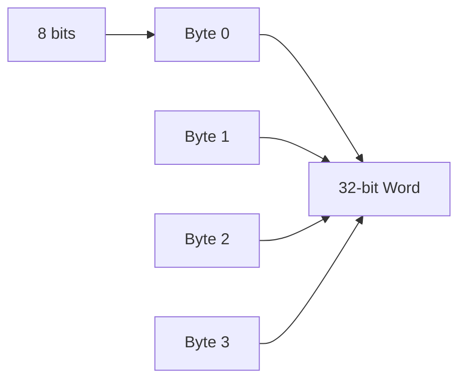

# Primary Memory

---

## Primary Memory

Where programs and data are stored

Can also be called *storage* but that term is usually reserved for **disk storage**

A non-negotiable part of computer operation

---

# Bits

---

## Bits

The basic unit of memory for all computers is the **bit**

A bit contains either a `1` or a `0`

And computers use bits because they are more "*efficient*"

Specifically, bits offer two main benefits
- reliability
- information density

---
layout: two-cols-header
---

## Reliability

::left::


A transistor works by being an *on* and *off* switch

There are 3 pins
- control,
- input, and
- output

::right::

By applying a small voltage to the control pin, it will **open or close** the circuit, 

- allowing the input to go to the output

And if the output is over a certain *threshold* (usually `2.5v`) 
- it's considered a 1

If we made the threshold smaller, we could get more values `0 1 2 3 4`

However, the likelihood of *noise* affecting the reading increases

---
layout: two-cols-header
---

## Information Density

Some older large computers are advertised as having *decimal arithmetic*, they do this using **4 bits** to store a single decimal digit called a **BCD** (Binary Coded Decimal)

Let's assume 16 bits

Both of the examples below show *1944*, but they have different **maximums**

::left::

```
BCD 0001 1001 0100 0100
```

Showcases 4 digits that can start at $0$ and ends at $9,999$

```
1010 1010 1010 1010
```

For a total of $10,000$ unique combinations

::right::

```
Binary 0000 0111 1001 1000
```

Showcases 16 digits of binary that can have a maximum of $65,535$

And can store a total of $65,536$ unique combinations

---

# Memory Addresses

---
layout: two-cols-header
---

## Memory Addresses

::left::
Memories consist of a number of **cells** (locations)

- each of which can store a *piece of information*,

- each has a number, called its **address** which programs can refer to,

- if a memory has $n$ cells, they will have *addresses* $0$ to $n-1$, and

- all cells in a memory contain the *same number of bits*

- if a cell consists of $k$ bits, then it can hold $2^k$ *combinations*

::right::

Below is an example of different combinations of a `96-bit` memory


---
layout: two-cols-header
---

## Memory Addresses (cont)

::left::
To **address** (meaning to find) a computer needs to have a certain amount of bits *reserved*

If an address (think of actual physical address) has $m$ bits, the maximum number of cells addressable is $2^m$

For example

To be able to address *all* the memory locations on the example on the left

> we need a minimum length of $4$ bits 

Because an address length of $3$ bits can only address up to $2^3 = 8$ bits

$2^4 = 16$

Which cell does `0100` address?

::right::


---
layout: two-cols-header
---

## Cell

::left::
A **Cell** is the smallest *addressable unit* (row)

In recent years, the majority of computer manufacturers have standardized on an 8-bit cell, which is called a **byte** (sometimes *octet*)

**bytes** are then grouped into **words**

- A `32-bit` computer has `4 bytes/word`
- A `64-bit` computer has `8 bytes/word`

::right::


---

# Byte Ordering

---

## Byte Ordering

Bytes in a word can numbered *left to right* or *right to left*

This is *relevant*


- $a$ represents a *left to right* ordering of a 32-bit computer

- $b$ represents a *right to left* ordering of a 32-bit computer

$a$ would be considered a **big endian** because the numbers start at the *big end (higher order)* and vice versa for **little endian**

> Imagine a 32 bit hex number `0x12345678`, `12` is the big end, `78` is the little end
> 
> Big endian starts at 12, little endian starts at 78

---

## Byte Ordering (cont)

For example, given a `32-bit` integer of value $6$ is represented by the bits `110` in the rightmost (low-order) 3 bits of a word

```
00000000 00000000 00000000 00000110
0        1        2        3
```

In a *big endian scheme*, the `110` bits would be in byte $3$ (or 7, or 11, etc)

In a *little endian scheme*, the `110` bits would be in byte $0$

In **both** cases, the *word* that contains this integer has the address of $0$

---

## Byte Ordering (cont)

If computers only stored integers, there would be no problem, but computers use a *mixture* of integers, characters, and other data types

For example, a simple personnel record (name `string`, age `int`, dept_id `int`)

And the string is terminated by `1` or more `0` bytes to fill out a word


Where $a$ is the *big endian* representation, and $b$ is the *little endian* representation

---

## Byte Ordering (cont)


Internally, they are fine and consistent, however a problem arises when one wants to *send the record* to another machine

If we assume that the *big endian* sends a record to the *little endian* **one byte at a time**, starting at byte $0$ and ending at byte $19$

> assuming that the bits of the byte aren't reversed

So the big endians byte $0$ goes into the little endians byte $0$

Printing the name would be fine, but the age comes out as $21 \cdot 2^{24}$ and the department is garbled

---

## Byte Ordering (cont)

In the modern day, this is *largely* fixed thanks to the separation of formatting of data and cpu reading

1. **Text-based Serialization**

We normally send data using text like `JSON` which has a more standard way of decoding (UTF-8) which is byte-order independent

2. **Binary Serialization Frameworks**

Things like Protobufs which both the sender and the receiver *agree upon* beforehand and so will correctly flip bytes as required

3. **Network Byte Order**

`TCP/IP` has largely agreed that everyone should be using *big-endian* (at least for low-level networking)

4. **Little Endian Monoculture**

Little-Endian has largely won the *consumer hardware war*.

---

## Error Correcting Codes
