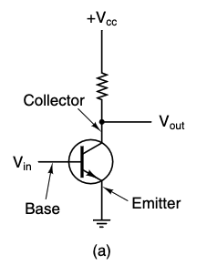
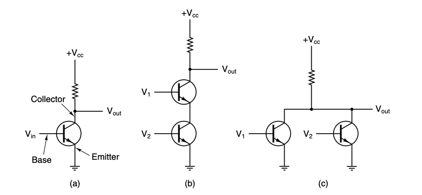
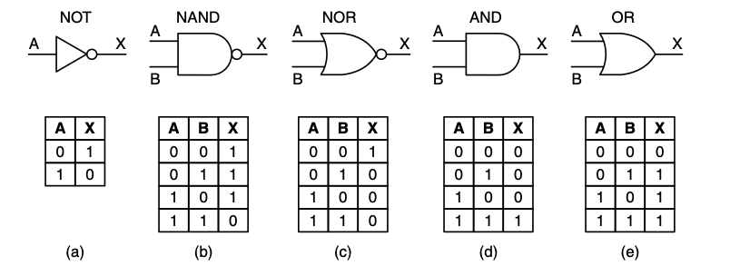
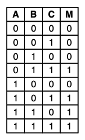
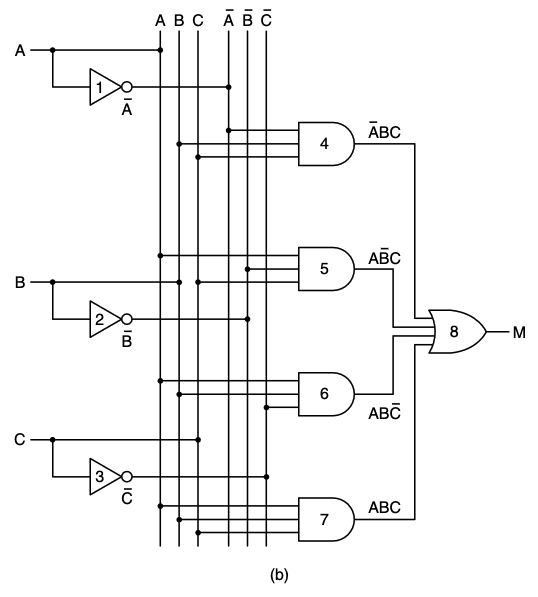
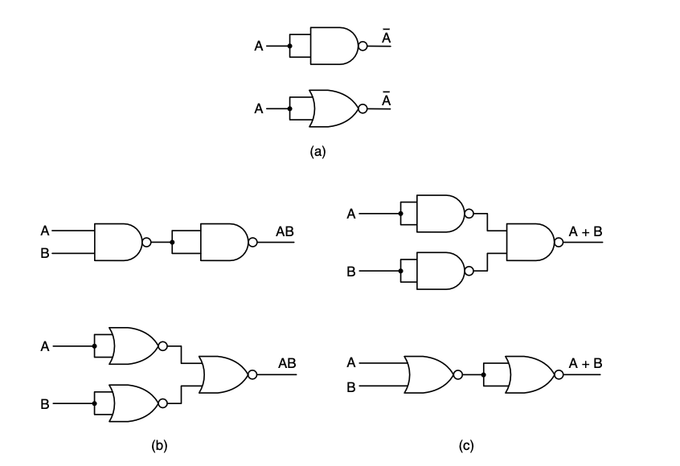
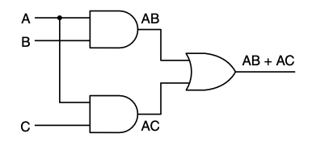
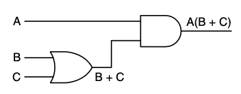
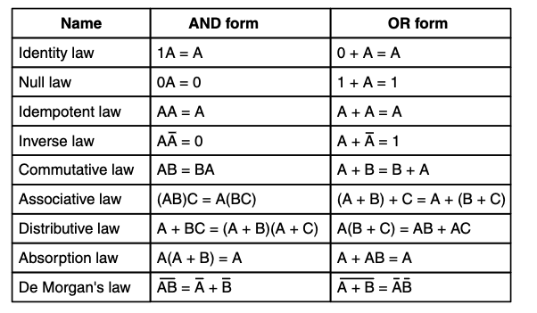

# The Digital Logic Level

---

## The bottom of the hierarchy

This is the computer's **real** hardware — the physical stuff the ISA level is built on top of.

We'll work our way up in three moves:

1. The *basic building blocks* — transistors and gates
2. A *formal algebra* for reasoning about them — boolean algebra
3. How those pieces combine into *fundamental circuits*

> Everything above this level (microarchitecture, ISA, operating system) eventually reduces to the circuits here.

---
layout: center
---

# Gates and Boolean Algebra

---
layout: two-cols-header
---

## Bits and voltages

::left::
A digital circuit works with two logical values:

- `0` — a *low* voltage
- `1` — a *high* voltage

We don't read the exact voltage, only whether it crosses a threshold.

The gap between the voltage ranges is called the **noise margin** — it lets a `1` still read as a `1` even when noise nudges the signal.

::right::

---
layout: two-cols-header
---

## The transistor

::left::
A transistor is simply an *on/off switch*, and it's how all gates are physically built.

It has **three pins**:

- the **base** (the *control*),
- the **collector** (the *input*),
- the **emitter** (the *output*).

::right::

By applying a small voltage to the **base**, we **open or close** the circuit:

- if the base is **low**, the collector and emitter are **disconnected**,
- if the base is **high**, the *input* flows through to the *output*.

---

## From transistors to gates

Wiring a few transistors together forms the elementary gates:

These three are the raw **building blocks** of digital circuits.

Where **a** is an *inverter*, **b** is a *NAND* gate, **c** is a *NOR* gate

---

## The inverter

So for our *inverter*, whenever $V_{in}$ is low, $V_{out}$ is high and vice versa

Where we're converting a logical $0$ to a logical $1$ and vice versa

---

## Gates

These three circuits, and their equivalents, form the three simplest gates called

`NOT`, `NAND`, and `NOR` gates

If we adopt the *convention* that "high" ($V_{cc}$ volts) is a logical $1$, and that "low" (ground) is a logical $0$, we can express the output value as a function of the input values

---
layout: center
---

# Boolean Algebra

---

## Boolean algebra

Named after **George Boole** (1815–1864), who showed that logic could be written down as *algebra*.

It works like regular algebra, but with only two values: $0$ and $1$.

A **boolean function** takes some variables and produces a single result.

For example, for one variable $a$:

$$f(a) = \begin{cases} 1 & \text{if } a = 0 \\ 0 & \text{if } a = 1 \end{cases}$$

Because a boolean function of $n$ variables has only $2^n$ input combinations, we can describe *any* function completely with a table:

> A **truth table** lists every possible input combination and the resulting output.

---
layout: two-cols-header
---

## Truth tables

If we agree to always list the rows of a truth table in numerical order (base 2), we can describe any function by the $2^n$ bit binary number obtained by reading the result column vertically 

For example

- `NAND` is `1110`
- `NOR` is `1000`
- `AND` is `0001`

So for any arbitrary two-variable boolean function, there exist only $16$ possible functions

---
layout: two-cols-header
---

## Worked example

::left::
Take this three variable function for example:

$$
M = f(A, B, C)
$$

This is a *majority function*, meaning it's 1 if a majority of the inputs are 1, and 0 otherwise

::right::

While any boolean function can be fully specified by giving the truth table, as the number of variables increases, the notation becomes more cumbersome 

So **another notation** is used

---
layout: two-cols-header
---

## Notation

Note that any boolean function can be specified by telling which combinations of input variables give an **output of $1$**

::left::

For example, there are four combinations of input variables that make $M$ into $1$

::right::

By convention, 

- we put a *bar* ($\bar{A}$) to indicate that a value is **inverted**,
- we use multiplication ($A \cdot B$ or $AB$) to mean the boolean **and** function, and 
- we use addition ($A + B$) to mean the boolean **or** function

---

## Sum of products

And so 

$$
M = \bar{A}BC + A\bar{B}C + AB\bar{C} + ABC
$$

is a compact way of giving the truth table

We describe this as

> A function of $n$ variables being a "*sum*" of at most $2^n$ $n$-variable "*product*" terms

This is why it's called a **sum of products**, there's also an alternative notation of **product of sums**

This is primarily useful for the **implementation** of these gates

---
layout: center
---

# Implementation of Boolean Functions

---
layout: two-cols-header
---

## From expression to circuit

::left::
Given a sum-of-products expression, we build a circuit in a few mechanical steps:

Starting from the truth table

Note that this is **neither** the *standard* nor the most *efficient* method of implementing these functions in circuits

But they do present an uncluttered and clear starting point which can be improved upon

::right::

Note the convention of a *dot* meaning connection, and no dot meaning no connection

---

## From expression to circuit

From that, it should be simple enough to derive a general method to implement a circuit

1. Write down the *truth table* (or the expression) of the function.
2. Provide *inverters* for every variable that appears negated.
3. Draw an AND gate for each **product** term.
4. **Wire** each AND gate to the variables it needs.
5. Feed all AND outputs into a single **OR gate**.

---
layout: center
---

# Circuit Equivalence

---

## Different circuits, same function

It's often convenient to implement circuits using only a single type of gate, primarily for manufacturing cost

Thankfully, converting a circuit to use only a single type of gate is straightforward enough

These use **`NAND`** and **`NOR`** gate forms as they are considered *universal gates*

---
layout: two-cols-header
---

## Circuit simplification

::left::

Circuit designers often try to *reduce the number* of gates in their products to 
- reduce the *chip area* needed to implement them, 
- *minimize* power consumption, and 
- increase *speed*

To reduce the complexity of a circuit, the designer must find another circuit that computes the **same function as the original** 

> But with fewer gates

Boolean algebra can be a valuable tool for this

::right::

For example

$$
AB + AC
$$

$$
A(B + C)
$$

Uses the *distributive law*

**Exercise:** build the truth tables for each of these. 

---

## Identities

Here are some major identities, but there are others

By using these identities, we can convert larger functions to smaller functions

---

## Reporting topics

Pick one topic and turn it into a short report.

- **The gates** — explain every gate (NOT, AND, OR, NAND, NOR, XOR) and why each one works the way it does
- **Proving the laws** — prove De Morgan's laws, the absorption law, and the AND form of the distributive law
- **Karnaugh maps** — use a Karnaugh map to simplify a boolean function and compare it with algebraic simplification
- **Universal gates** — show that NAND (and NOR) alone can build every other gate, and why that matters in practice
